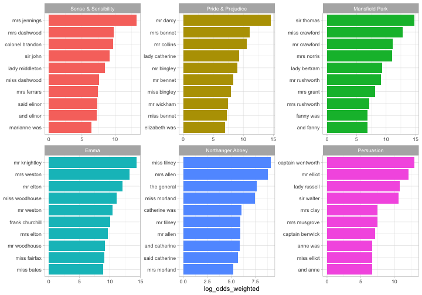

<!-- README.md is generated from README.Rmd. Please edit that file -->

# tidylo: Weighted Tidy Log Odds Ratio ⚖️

<!-- badges: start -->

[](https://CRAN.R-project.org/package=tidylo)
[](https://github.com/juliasilge/tidylo/actions/workflows/check-standard.yaml)
[](https://app.codecov.io/gh/juliasilge/tidylo?branch=main)
[](https://lifecycle.r-lib.org/articles/stages.html)
<!-- badges: end -->

**Authors:** [Julia Silge](https://juliasilge.com/), [Alex
Hayes](https://www.alexpghayes.com/), [Tyler
Schnoebelen](https://www.letslanguage.org/)<br/> **License:**
[MIT](https://opensource.org/licenses/MIT)

How can we measure how the usage or frequency of some **feature**, such
as words, differs across some group or **set**, such as documents? One
option is to use the log odds ratio, but the log odds ratio alone does
not account for sampling variability; we haven’t counted every feature
the same number of times so how do we know which differences are
meaningful?

Enter the **weighted log odds**, which tidylo provides an implementation
for, using tidy data principles. In particular, here we use the method
outlined in [Monroe, Colaresi, and Quinn
(2008)](https://doi.org/10.1093/pan/mpn018) to weight the log odds ratio
by a prior. By default, the prior is estimated from the data itself, an
empirical Bayes approach, but an uninformative prior is also available.

## Installation

You can install the released version of tidylo from
[CRAN](https://CRAN.R-project.org) with:

``` r
install.packages("tidylo")
```

Or you can install the development version from GitHub with
[devtools](https://devtools.r-lib.org/):

``` r
# install.packages("devtools")
devtools::install_github("juliasilge/tidylo")
```

## Example

Using weighted log odds is a great approach for text analysis when we
want to measure how word usage differs across a set of documents. Let’s
explore the [six published, completed novels of Jane
Austen](https://github.com/juliasilge/janeaustenr) and use the
[tidytext](https://github.com/juliasilge/tidytext) package to count up
the bigrams (sequences of two adjacent words) in each novel. This
weighted log odds approach would work equally well for single words.

``` r
library(dplyr)
#> 
#> Attaching package: 'dplyr'
#> The following objects are masked from 'package:stats':
#> 
#>     filter, lag
#> The following objects are masked from 'package:base':
#> 
#>     intersect, setdiff, setequal, union
library(janeaustenr)
library(tidytext)

tidy_bigrams <- austen_books() %>%
    unnest_tokens(bigram, text, token = "ngrams", n = 2) %>%
    filter(!is.na(bigram))

bigram_counts <- tidy_bigrams %>%
    count(book, bigram, sort = TRUE)

bigram_counts
#> # A tibble: 300,903 × 3
#>    book                bigram     n
#>    <fct>               <chr>  <int>
#>  1 Mansfield Park      of the   712
#>  2 Mansfield Park      to be    612
#>  3 Emma                to be    586
#>  4 Mansfield Park      in the   533
#>  5 Emma                of the   529
#>  6 Pride & Prejudice   of the   439
#>  7 Emma                it was   430
#>  8 Pride & Prejudice   to be    422
#>  9 Sense & Sensibility to be    418
#> 10 Emma                in the   416
#> # … with 300,893 more rows
```

Now let’s use the `bind_log_odds()` function from the tidylo package to
find the weighted log odds for each bigram. The weighted log odds
computed by this function are also
[z-scores](https://en.wikipedia.org/wiki/Standard_score) for the log
odds; this quantity is useful for comparing frequencies across
categories or sets but its relationship to an odds ratio is not
straightforward after the weighting.

What are the bigrams with the highest weighted log odds for these books?

``` r
library(tidylo)

bigram_log_odds <- bigram_counts %>%
    bind_log_odds(book, bigram, n) 

bigram_log_odds %>%
    arrange(-log_odds_weighted)
#> # A tibble: 300,903 × 4
#>    book                bigram                n log_odds_weighted
#>    <fct>               <chr>             <int>             <dbl>
#>  1 Mansfield Park      sir thomas          266              27.2
#>  2 Pride & Prejudice   mr darcy            230              27.0
#>  3 Emma                mr knightley        239              25.9
#>  4 Sense & Sensibility mrs jennings        185              24.3
#>  5 Emma                mrs weston          208              24.2
#>  6 Mansfield Park      miss crawford       196              23.4
#>  7 Persuasion          captain wentworth   143              23.0
#>  8 Persuasion          mr elliot           133              22.2
#>  9 Emma                mr elton            174              22.1
#> 10 Mansfield Park      mrs norris          148              20.3
#> # … with 300,893 more rows
```

The bigrams more likely to come from each book, compared to the others,
involve proper nouns. We can make a visualization as well.

``` r
library(ggplot2)

bigram_log_odds %>%
    group_by(book) %>%
    slice_max(log_odds_weighted, n = 10) %>%
    ungroup() %>%
    mutate(bigram = reorder(bigram, log_odds_weighted)) %>%
    ggplot(aes(log_odds_weighted, bigram, fill = book)) +
    geom_col(show.legend = FALSE) +
    facet_wrap(vars(book), scales = "free") +
    labs(y = NULL)
```



### Community Guidelines

This project is released with a [Contributor Code of
Conduct](https://contributor-covenant.org/version/2/1/CODE_OF_CONDUCT.html).
By contributing to this project, you agree to abide by its terms.
Feedback, bug reports (and fixes!), and feature requests are welcome;
file issues or seek support
[here](https://github.com/juliasilge/tidylo/issues).
