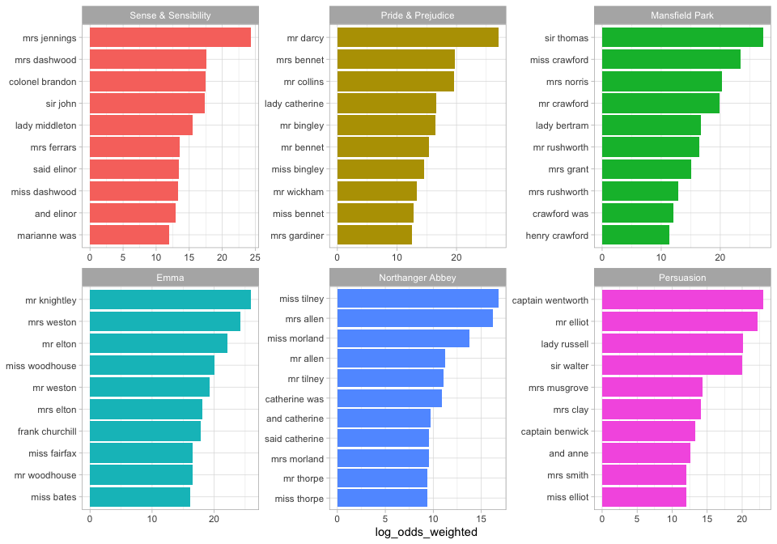

<!-- README.md is generated from README.Rmd. Please edit that file -->


# tidylo: Tidy Log Odds Ratio Weighted by Uninformative Prior

**Authors:** [Julia Silge](https://juliasilge.com/), [Tyler Schnoebelen](https://www.letslanguage.org/)<br/>
**License:** [MIT](https://opensource.org/licenses/MIT)


<!-- badges: start -->
[](https://travis-ci.org/juliasilge/tidylo)
[](https://ci.appveyor.com/project/juliasilge/tidylo)
[](https://codecov.io/gh/juliasilge/tidylo?branch=master)
<!-- badges: end -->

How can we measure how the usage or frequency of some **feature**, such as words, differs across some group or **set**, such as documents? One option is to use the log odds ratio, but the log odds ratio alone does not account for sampling variability; we haven't counted every feature the same number of times so how do we know which differences are meaningful? 

Enter the **weighted log odds**, which tidylo provides an implementation for, using tidy data principles. In particular, here we use the method outlined in [Monroe, Colaresi, and Quinn (2017)](https://doi.org/10.1093/pan/mpn018) to weight the log odds ratio by an uninformative Dirichlet prior.

## Installation

~You can install the released version of tidylo from [CRAN](https://CRAN.R-project.org) with:~


```r
install.packages("tidylo")
```


Or you can install the development version from GitHub with [remotes](https://github.com/r-lib/remotes):


```r
library(remotes)
install_github("juliasilge/tidylo")
```

## Example

Using weighted log odds is a great approach for text analysis when we want to measure how word usage differs across a set of documents. Let's explore the [six published, completed novels of Jane Austen](https://github.com/juliasilge/janeaustenr) and use the [tidytext](https://github.com/juliasilge/tidytext) package to count up the bigrams (sequences of two adjacent words) in each novel. This weighted log odds approach would work equally well for single words.


```r
library(dplyr)
library(janeaustenr)
library(tidytext)

tidy_bigrams <- austen_books() %>%
     unnest_tokens(bigram, text, token="ngrams", n = 2)

bigram_counts <- tidy_bigrams %>%
     count(book, bigram, sort = TRUE)

bigram_counts
#> # A tibble: 328,495 x 3
#>    book                bigram     n
#>    <fct>               <chr>  <int>
#>  1 Mansfield Park      of the   748
#>  2 Mansfield Park      to be    643
#>  3 Emma                to be    607
#>  4 Mansfield Park      in the   578
#>  5 Emma                of the   566
#>  6 Pride & Prejudice   of the   464
#>  7 Emma                it was   448
#>  8 Emma                in the   446
#>  9 Pride & Prejudice   to be    443
#> 10 Sense & Sensibility to be    436
#> # … with 328,485 more rows
```

Now let's use the `bind_log_odds()` function from the tidylo package to find the weighted log odds for each bigram. What are the highest log odds bigrams for these books?


```r
library(tidylo)

bigram_log_odds <- bigram_counts %>%
  bind_log_odds(bigram, book, n) 

bigram_log_odds %>%
  arrange(-log_odds)
#> # A tibble: 328,495 x 4
#>    book                bigram                n log_odds
#>    <fct>               <chr>             <int>    <dbl>
#>  1 Mansfield Park      sir thomas          287     14.8
#>  2 Pride & Prejudice   mr darcy            243     14.5
#>  3 Emma                mr knightley        269     14.3
#>  4 Sense & Sensibility mrs jennings        199     13.2
#>  5 Emma                mrs weston          229     13.2
#>  6 Persuasion          captain wentworth   170     13.0
#>  7 Mansfield Park      miss crawford       215     12.8
#>  8 Persuasion          mr elliot           147     12.1
#>  9 Emma                mr elton            190     12.0
#> 10 Mansfield Park      mr crawford         162     11.1
#> # … with 328,485 more rows
```

The highest log odds bigrams (bigrams more likely to come from each book, compared to the others) involve proper nouns. We can make a visualization as well.


```r
library(ggplot2)

bigram_log_odds %>%
  group_by(book) %>%
  top_n(10) %>%
  ungroup %>%
  mutate(bigram = reorder(bigram, log_odds)) %>%
  ggplot(aes(bigram, log_odds, fill = book)) +
  geom_col(show.legend = FALSE) +
  facet_wrap(~book, scales = "free") +
  coord_flip() +
  labs(x = NULL)
#> Selecting by log_odds
```



### Community Guidelines

This project is released with a
[Contributor Code of Conduct](https://github.com/juliasilge/tidylo/blob/master/CONDUCT.md).
By contributing to this project, you agree to abide by its terms. Feedback, bug reports (and fixes!), and feature requests are welcome; file issues or seek support [here](http://github.com/juliasilge/tidylo/issues).

